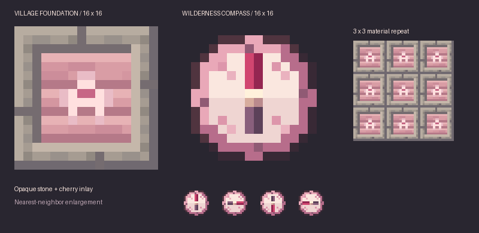

# Sakura art delivery

The production textures replace all 33 stub PNGs in
`src/main/resources/assets/siasworkshop/textures/` at their original paths.

- `block/village_foundation.png`: 16×16 opaque RGB, 15-color warm stone and cherry
  plank palette with a pale blossom inlay.
- `item/wilderness_compass_00.png` through `_31.png`: 16×16 RGBA, 17 colors including
  transparency, fixed plum/pink rim, pale floral dial and raspberry/plum needle.
- [logo.png](logo.png): 1254×1254 RGB storefront icon, kept outside the mod resources.

[All 32 static compass directions](compass-frames.png) are separate full item
textures. There is no GIF, animated texture strip or `.mcmeta` animation.
Minecraft selects a frame using the existing angle overrides. Frame 00 points
down, 08 left, 16 up and 24 right; increasing indices turn clockwise. The pivot
is the image-space point (8, 8), sampled at each pixel's center. The dial and
alpha silhouette remain identical beneath the rotating needle.

## Reproduce the pixel assets

Run `python3 tools/gen_final_textures.py` with Pillow installed. This regenerates
the 33 final PNGs and both static preview sheets deterministically. The script
contains the native-resolution art refinement; it does not call an image API.
Do not run the historical `gen_stub_textures.py` over the final assets.

Original concepts are saved in `concepts/`; the exact built-in ImageGen prompts
are recorded in [generation-prompts.md](generation-prompts.md). The logo is a
separate generated deliverable and is not overwritten by the refinement script.

## Model integration

The existing angle table referenced 31 absent direction-model JSONs. The item
model datagen provider now creates the complete 32-model family. Generated JSON
is checked in under `src/generated/resources/assets/siasworkshop/models/item/`.
The hand-written angle table and gameplay logic are unchanged.

Regenerate models with `./gradlew runData`, then run `./gradlew build` separately
so the resource copy and JAR include the newly generated files.

## Verification

- Dimensions, PNG encoding, opaque foundation and binary compass alpha checked.
- All 32 frames unique, with fixed dial pixels and alpha silhouette; needle
  centroids within 10° of each intended 11.25° step at native pixel resolution.
- Native-resolution sprites reviewed through nearest-neighbor enlarged sheets.
- Datagen and build passed; packaged model references and texture bytes checked.
- No interactive Minecraft client/world visual check was performed.

This delivery applies to the current 1.21.1 checkout. It does not publish a new
release, upload the logo, or port changes to the separate 1.20.1 branch.
